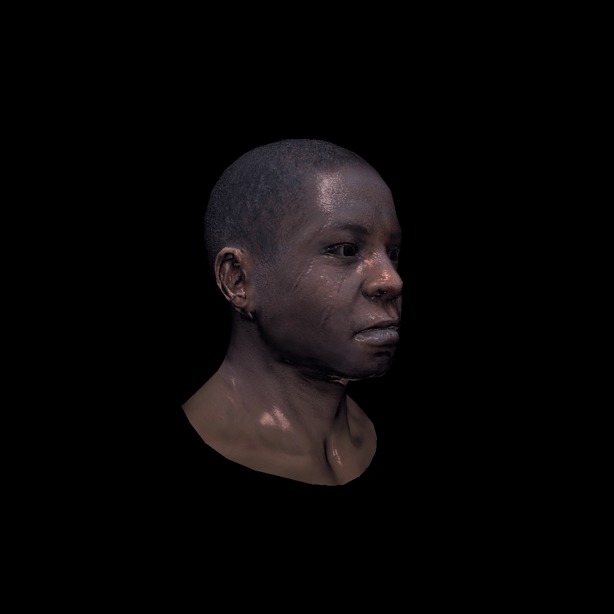
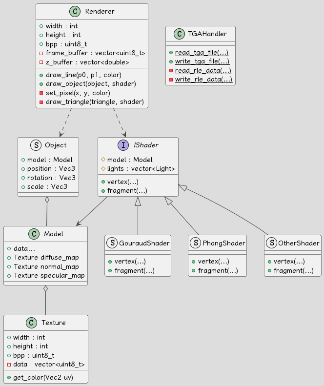

# Graphics - TinyRenderer

[中文版](doc/README_CN.md)

> You can see the output images [here](image)
> 
> *As GitHub do not support `.tga` image, you may need to download it to see the effect*

This is the final project for Computer Graphics course, a tiny software renderer based on [tinyrenderer](https://github.com/ssloy/tinyrenderer/wiki).

My goal is to create a tiny and flexible renderer core that does not rely on any third-party libraries,
which can be a good practice for learning computer graphics.



## Features

- [x] No Third-Party Libraries
- [x] Tiny and Flexible architecture
- [x] Custom Geometry Library (Vector, Matrix)
- [x] `.obj` Model Reader
- [x] `.tga` Image Reader / Writer (with rle compression)
- [x] Line Drawing
- [x] Barycentric Coordinate
- [x] Triangle Rasterization
- [x] Depth Buffer (Z-Buffer)
- [x] Normal Mapping
- [x] Texture Mapping
- [x] Phong Shading
- [x] Customizable Shader
- [ ] Shadow Mapping
- [ ] Anti-Aliasing

## Architecture



- [main.cpp](main.cpp)

Here is the main process of this program.

1. Define basic information, such as image size, model path, Camera etc.
2. Load the model and texture.
3. Create a Renderer and Shader.
4. Set transformation matrix and viewport matrix.
5. Rendering!!!
6. Save the image.

You can define your own Shader in the `main.cpp` file.

- [geometry.h](geometry.h) & [color.h](color.h)

They are the basic geometry and color classes, which are used to define the basic data structure of the program.

`geometry` uses `template` to define the `Vec<int>`, `Mat<int, int>` classes, which are used to represent vectors and matrices.
And it implements some basic vectors and matrices operations, such as `+`, `-`, `*`, `/` , etc. 
and some useful functions, like `cross()`, `normalize()`, `invert()`, `transpose()`, etc.

`color` defines the `Color` class, which is used to represent the color of the image, using `uint8_t` to store the color data.

- [texture.h](texture.h) & [model.h](model.h) 

They are designed to load texture and model.

`texture` defines the `Texture` class, which stores the color data of the texture image.
And it provides `get_color(uv)` function to let other classes get the color of the texture image at the given uv coordinate.

`model` defines the `Model` class, which can read `.obj` model files and load its data (vertex, face, texture, etc.) into memory.

- [renderer.h](renderer.h)

It defines the `Renderer` class, which is the core of the program. 
It contains the main rendering algorithms, such as line drawing, barycentric getting, triangle rasterization, etc.

The image color data will be stored in a `vector<uint8_t>` named `frame_buffer`, which is a raw, low-level format. 
I use bpp(bit per pixel) as the offset to store pixel color and to index.

- [shader.h](shader.h)

It is a collection of classes and methods related to rendering, which includes tools such as `Object` and `Camera`.
It also defines the basic `IShader` interface, which serves as the base class for all shaders.

- [tga-handler.h](tga-handler.h)

It is a static TGA image reader and writer, which can read and write TGA images with RLE compression.

## Implementation

### Line Drawing

Implement of Bresenham's line algorithm, which can draw a line from p0 to p1.

```c++
// Bresenham's line algorithm
void Renderer::draw_line(Vec2 p0, Vec2 p1, const Color &color) {
    // if (dx < dy) the line is steep
    // we need to sample it along y axis
    // but we can also get_transpose it, then we can still use x axis
    // just remember to re-get_transpose it when drawing it
    bool steep = false;
    if (std::abs(p0.x - p1.x) < std::abs(p0.y - p1.y)) {
        // get_transpose
        std::swap(p0.x, p0.y);
        std::swap(p1.x, p1.y);
        steep = true;
    }
    // make it left−to−right
    if (p0.x > p1.x) std::swap(p0, p1);

    // use error to approximate the distance between the line and the pixel, which can improve performance
    int x0 = std::floor(p0.x), y0 = std::floor(p0.y);
    int x1 = std::floor(p1.x), y1 = std::floor(p1.y);
    int dx = x1 - x0;
    int dy = y1 - y0;
    int per_error = std::abs(dy) * 2;
    int error = 0;
    int y = y0;
    for (int x = x0; x <= p1.x; x++) {
        if (steep)
            set_pixel(y, x, color); // if transposed, de−get_transpose
        else
            set_pixel(x, y, color);

        error += per_error;
        if (error > dx) {
            y += (p1.y > p0.y ? 1 : -1);
            error -= 2 * dx;
        }
    }
}
```

### Triangle Drawing

#### Line Sweeping

A traditional way to draw a triangle, but it is an old-school approach designed for mono-thread CPU programming, which is not used so much.

*The following line sweeping algorithm is based on Bresenham's line drawing algorithm.*

```c++
// line sweeping triangle drawing
void Renderer::draw_triangle_linesweeping(Vec2 p0, Vec2 p1, Vec2 p2, const Color &color) {
    if (p0.y == p1.y && p1.y == p2.y) return;
    // make p0.y < p1.y < p2.y
    if (p0.y > p1.y) std::swap(p0, p1);
    if (p0.y > p2.y) std::swap(p0, p2);
    if (p1.y > p2.y) std::swap(p1, p2);

    double total_height = p2.y - p0.y;
    for (int y = 0; y <= total_height; ++y) {
        bool second_half = y > p1.y - p0.y || p0.y == p1.y;
        double segment_height = second_half ? p2.y - p1.y : p1.y - p0.y;
        double alpha = static_cast<double>(y) / total_height;
        double beta = static_cast<double>(y - (second_half ? p1.y - p0.y : 0)) / segment_height;
        Vec2 A = p0 + (p2 - p0) * alpha;
        Vec2 B = second_half ? p1 + (p2 - p1) * beta : p0 + (p1 - p0) * beta;
        if (A.x > B.x) std::swap(A, B);
        for (int x = static_cast<int>(A.x); x <= B.x; ++x) {
            set_pixel(x, static_cast<int>(p0.y + y), color);
        }
    }
}
```

#### Rasterization

Iterate through all pixels of a bounding box and check whether a point belongs a 2D triangle.

There are two ways to check whether a point belongs a 2D triangle.

- Barycentric

[Barycentric](https://en.wikipedia.org/wiki/Barycentric_coordinate_system) is truly a useful feature of triangle which can be used to interpolation. 
Here, we first use it to check a point.

```c++
// get barycentric
Vec3 Renderer::get_barycentric2D(const Vec2 *t, const Vec2 &p) {
    Mat<3, 3> ABC = {{embed<3>(t[0]), embed<3>(t[1]), embed<3>(t[2])}};
    if (std::abs(ABC.det()) < 1e-3) return {-1, 1, 1}; // degenerate check
    return ABC.invert().transpose() * embed<3>(p);
}
```

The function provided above calculates barycentric coordinates using the inverse matrix, 
but the method of finding the inverse matrix in [geometry.h](geometry.h) is implemented through recursion, which can severely degrade performance.
We can use the following method, which calculates using area ratios, as an alternative.

```c++
// get barycentric
Vec3 Renderer::get_barycentric2D(const std::array<Vec2, 3> &t_vert, const Vec2 &p) {
    // calculate by area
    double x0 = t_vert[0][0], y0 = t_vert[0][1];
    double x1 = t_vert[1][0], y1 = t_vert[1][1];
    double x2 = t_vert[2][0], y2 = t_vert[2][1];
    double t_area = x0 * (y1 - y2) + x1 * (y2 - y0) + x2 * (y0 - y1);
    if (std::abs(t_area) < 1e-3) return {-1, 1, 1}; // degenerate check
    double u = (p.x * (y1 - y2) + (x2 - x1) * p.y + x1 * y2 - x2 * y1) / t_area;
    double v = (p.x * (y2 - y0) + (x0 - x2) * p.y + x2 * y0 - x0 * y2) / t_area;
    return {u, v, 1.0 - u - v};
}
```

- Cross Product

We can also use cross product to check a point.
Just take the cross product of each side of the triangle with the line connecting each vertex to the given point. 

If the results all have the same sign, then the point is inside the triangle.

```c++
// judge by cross product (like GAMES101)
bool Renderer::is_inside_triangle_cross_product(Vec2 *t, const Vec2 &P) {
    Vec2 AB = t[1] - t[0];
    Vec2 BC = t[2] - t[1];
    Vec2 CA = t[0] - t[2];
    Vec2 AP = P - t[0];
    Vec2 BP = P - t[1];
    Vec2 CP = P - t[2];
    double z1 = cross(AB, AP);
    double z2 = cross(BC, BP);
    double z3 = cross(CA, CP);
    return (z1 > 0 && z2 > 0 && z3 >0) || (z1 < 0 && z2 < 0 && z3 < 0);
}
```

- Draw

Then we can draw the triangle with the following steps.

1. find the bounding box (accelerate the calculation)
2. iterate all pixels in the bounding box
3. judge whether the pixel is in the given triangle and whether it can pass the depth test
4. if not, continue; if yes, fill the pixel with the given Color

*In this case, I use barycentric to check the point.*

```c++
// triangle drawing with barycentric
void Renderer::draw_triangle(const Mat<3, 4> &t_vert_clip, IShader &shader) {
    // clip space 2 screen space
    std::array<Vec2, 3> t_vert_screen_vec2 = {
            resize<2>(ViewportMatrix * t_vert_clip[0] / t_vert_clip[0][3]),
            resize<2>(ViewportMatrix * t_vert_clip[1] / t_vert_clip[1][3]),
            resize<2>(ViewportMatrix * t_vert_clip[2] / t_vert_clip[2][3])
    };
    // create bounding box
    int bbox_min[2] = {width_ - 1, height_ - 1};
    int bbox_max[2] = {0, 0};
    for (int i = 0; i < 3; ++i)
        for (int j = 0; j < 2; ++j) {
            bbox_min[j] = std::min(bbox_min[j], static_cast<int>(t_vert_screen_vec2[i][j]));
            bbox_max[j] = std::max(bbox_max[j], static_cast<int>(t_vert_screen_vec2[i][j]));
        }
    // Ensure the bounding box is within the image boundaries
    bbox_min[0] = std::max(0, bbox_min[0]);
    bbox_min[1] = std::max(0, bbox_min[1]);
    bbox_max[0] = std::min(width_ - 1, bbox_max[0]);
    bbox_max[1] = std::min(height_ - 1, bbox_max[1]);

#pragma omp parallel for // omp optimization (I hope so)
    for (int x = bbox_min[0]; x <= bbox_max[0]; x++) {
        for (int y = bbox_min[1]; y <= bbox_max[1]; y++) {
            Vec3 bc_screen = get_barycentric2D(t_vert_screen_vec2, {static_cast<double>(x), static_cast<double>(y)});
            if (bc_screen.x < 0 || bc_screen.y < 0 || bc_screen.z < 0) continue; // triangle testing

            // inside triangle
            Vec3 bc_clip = {bc_screen.x / t_vert_clip[0][3], bc_screen.y / t_vert_clip[1][3], bc_screen.z / t_vert_clip[2][3]};
            bc_clip = bc_clip / (bc_clip.x + bc_clip.y + bc_clip.z); // perspective correction, make sure bc.x + bc.y + bc.z = 1
            double depth = t_vert_clip[0][2] * bc_clip.x + t_vert_clip[1][2] * bc_clip.y + t_vert_clip[2][2] * bc_clip.z;
            if (depth > depth_buffer_[x + y * width_]) continue; // depth testing

            // depth test passed
            Color color;
            if (!shader.fragment(bc_clip, color)) continue;

            // fragment shader passed
            set_pixel(x, y, color);
            depth_buffer_[x + y * width_] = depth;
        }
    }
}
```

### Transformation

The transformation matrix is used to transform the model from the model space to the screen space, here is the detail.

Model Space -> World Space -> View Space -> Clip Space -> (NDC) -> Screen Space

- Model Matrix (Model Space -> World Space)

```c++
void set_model_mat(double angle, double scale, Vec3 translate) {
    angle = angle * M_PI / 180.0;
    Mat<4, 4> rotation_mat({{{
        {cos(angle), 0, sin(angle), 0},
        {0, 1, 0, 0},
        {-sin(angle), 0, cos(angle), 0},
        {0, 0, 0, 1}
    }}});

    Mat<4, 4> scale_mat({{{
        {scale, 0, 0, 0},
        {0, scale, 0, 0},
        {0, 0, scale, 0},
        {0, 0, 0, 1}
    }}});

    Mat<4, 4> translate_mat({{{
        {1, 0, 0, translate.x},
        {0, 1, 0, translate.y},
        {0, 0, 1, translate.z},
        {0, 0, 0, 1}
    }}});

    ModelViewMatrix = translate_mat * rotation_mat * scale_mat;
}
```

- View Matrix (World Space -> View Space)

```c++
void set_view_mat(const Vec3 &eye_point) {
    Mat<4, 4> view_matrix = {{{
        {1, 0, 0, -eye_point.x},
        {0, 1, 0, -eye_point.y},
        {0, 0, 1, -eye_point.z},
        {0, 0, 0, 1}
    }}};

    ModelViewMatrix = view_matrix * ModelViewMatrix;
}
```

- Projection Matrix (View Space -> Clip Space)

```c++
void set_projection_mat(double fov, double aspect_ratio, double zNear, double zFar) {
    Mat<4, 4> p2o({{{
        {zNear, 0, 0, 0},
        {0, zNear, 0, 0},
        {0, 0, zNear + zFar, -zNear * zFar},
        {0, 0, 1, 0}
    }}});

    double angle = fov / 180.0 * M_PI;
    double t = tan(angle / 2) * zNear;
    double b = -t;
    double r = t * aspect_ratio;
    double l = -r;
    Mat<4, 4> o2c({{{
        {2 / (r - l), 0, 0, -(r + l) / (r - l)},
        {0, 2 / (t - b), 0, -(t + b) / (t - b)},
        {0, 0, 2 / (zNear - zFar), -(zNear + zFar) / (zNear - zFar)},
        {0, 0, 0, 1}
    }}});

    ProjectionMatrix = o2c * p2o;
}
```

- Viewport Matrix (Clip Space -> Screen Space)

```c++
void set_viewport_mat(int x, int y, int w, int h) {
    ViewportMatrix = {{{
        {w / 2.0, 0, 0, x + w / 2.0},
        {0, h / 2.0, 0, y + h / 2.0},
        {0, 0, 0.5, 0.5},
        {0, 0, 0, 1}
    }}};
}
```

### Shading

- Basic Vertex Shader

It is a basic vertex shader, which can transform the vertex from model space to clip space and store some data.

The following fragment shaders are all based on this vertex shader.

```c++
struct StandardVertexShader : IShader {
public:
    explicit StandardVertexShader(const Model& model, std::vector<Light>&& lights = std::vector<Light>())
        : IShader(model, std::move(lights)) {
        for (auto& light : lights_) {
            // uniform light direction in view coordinates
            light.direction = resize<3>((ModelViewMatrix * resize<4>(light.direction, 0))).normalize();
            light.intensity = resize<3>((ModelViewMatrix * resize<4>(light.intensity, 0)));
        }
    }

    void vertex(int i_face, int nth_vert, Vec4 &ret_vert) override {
        // column-major order, which is convenient for fragment shader
        varying_uv.set_col(nth_vert, model_.uv(i_face, nth_vert));
        varying_normal.set_col(nth_vert,
                               resize<3>( (ModelViewMatrix).invert_transpose() * resize<4>(model_.normal(i_face, nth_vert), 0) ));
        // model space -> world space -> view space
        ret_vert = ModelViewMatrix * resize<4>(model_.vert(i_face, nth_vert), 1);
        // store the vertex in view space for the fragment shader
        t_vert_view_space.set_col(nth_vert, resize<3>(ret_vert));
        // view space -> clip space
        ret_vert = ProjectionMatrix * ret_vert;
    }

protected:
    Mat<2, 3> varying_uv;
    Mat<3, 3> varying_normal;
    Mat<3, 3> t_vert_view_space;
};
```

- Gouraud Shading

Gouraud shading only considers the normal and light direction.

```c++
bool fragment(const Vec3 &bc, Color &ret_color) override {
    Vec3 interpolated_normal = (varying_normal * bc).normalize();
    double intensity = 0.0;
    for (const auto& light : lights_) {
        intensity += std::max(0.0, interpolated_normal * light.direction);
    }
    ret_color = Color{255, 255, 255, 255} * intensity;
    return true;
}
```

- Phong Shading (with Texture Mapping)

Phong shading assumes that lights can be decomposed into three components: ambient, diffuse, and specular.

```c++
bool fragment(const Vec3 &bc, Color &ret_color) override {
    Vec3 interpolated_normal = (varying_normal * bc).normalize();
    Vec2 interpolated_uv = varying_uv * bc;
    double intensity = 0.0;
    for (const auto &light: lights_) {
        double diffuse = std::max(0.0, interpolated_normal * light.direction);
        Vec3 reflected_light = (interpolated_normal * (interpolated_normal * light.direction) * 2 - light.direction).normalize();
        double specular = std::pow(std::max(0.0, -reflected_light.z), model_.specular()->get_color(interpolated_uv)[0] + 5);
        intensity += diffuse + specular;
    }
    Color fragment_color = model_.diffuse()->get_color(interpolated_uv);
    for (int i : {0, 1, 2}) {
        ret_color[i] = std::min<int>((int)(fragment_color[i] * intensity), 255);
    }
    return true;
}
```

- Phong Shading (with Normal Mapping)

Normal mapping is a technique used for faking the lighting of bumps and dents.

```c++
bool fragment(const Vec3 &bc, Color &ret_color) override {
    Vec3 interpolated_normal = (varying_normal * bc).normalize();
    Vec2 interpolated_uv = varying_uv * bc;

    Mat<3, 3> AI = Mat<3, 3>{{
        t_vert_view_space.col(1) - t_vert_view_space.col(0),
        t_vert_view_space.col(2) - t_vert_view_space.col(0),
        interpolated_normal
    }}.invert();
    Vec3 tangent = AI * Vec3{
        varying_uv[0][1] - varying_uv[0][0],
        varying_uv[0][2] - varying_uv[0][0],
        0};
    Vec3 bitangent = AI * Vec3{
        varying_uv[1][1] - varying_uv[1][0],
        varying_uv[1][2] - varying_uv[1][0],
        0};
    Mat<3, 3> TBN = Mat<3, 3>{{
        tangent.normalize(),
        bitangent.normalize(),
        interpolated_normal}}.transpose();
    Vec3 mapping_normal = (TBN * model_.normal(interpolated_uv)).normalize();
    double intensity = 0.0;
    for (const auto &light: lights_) {
        double diffuse = std::max(0.0, mapping_normal * light.direction);
        Vec3 reflected_light = (mapping_normal * (mapping_normal * light.direction) * 2 - light.direction).normalize();
        double specular = std::pow(std::max(-reflected_light.z, 0.0), model_.specular()->get_color(interpolated_uv)[0] + 5);
        intensity += diffuse + specular;
    }
    Color fragment_color = model_.diffuse()->get_color(interpolated_uv);
    for (int i : {0, 1, 2}) {
        ret_color[i] = std::min((int)(fragment_color[i] * intensity + amb_light_intensity[i]), 255);
    }
    return true;
}
```