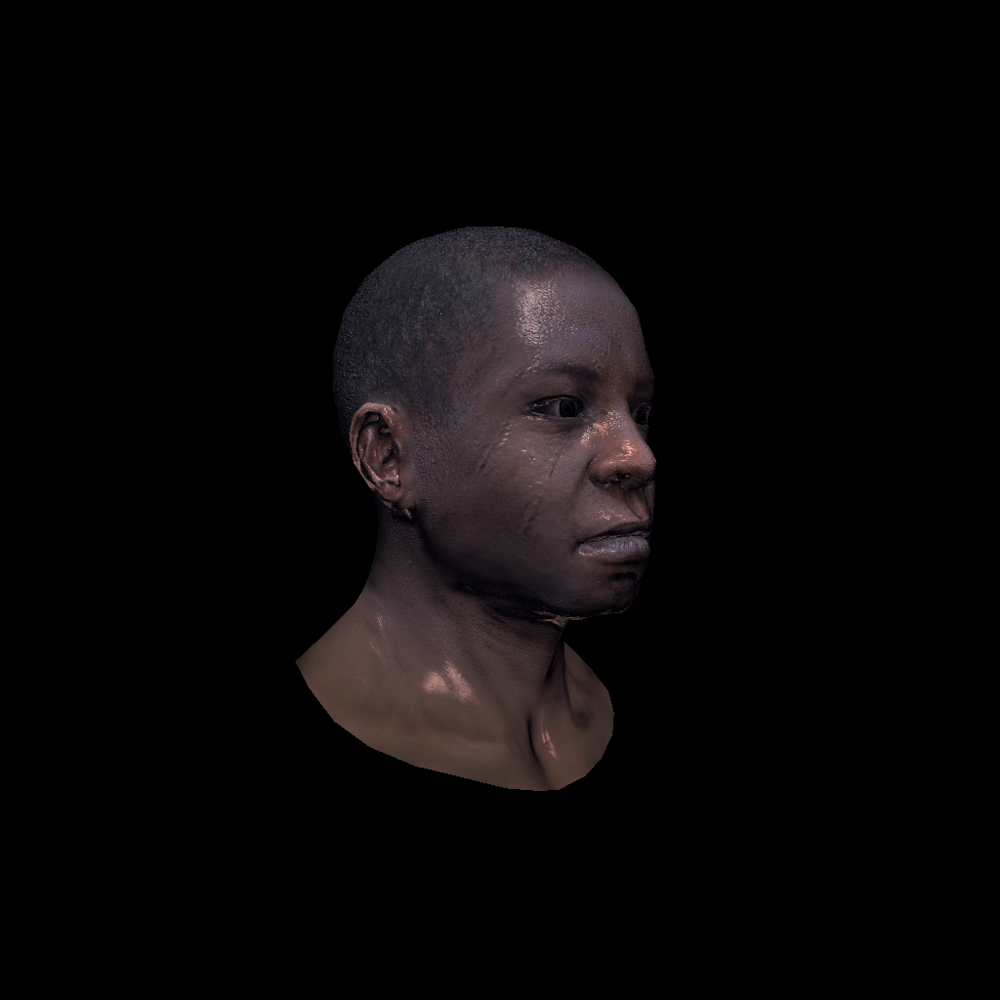
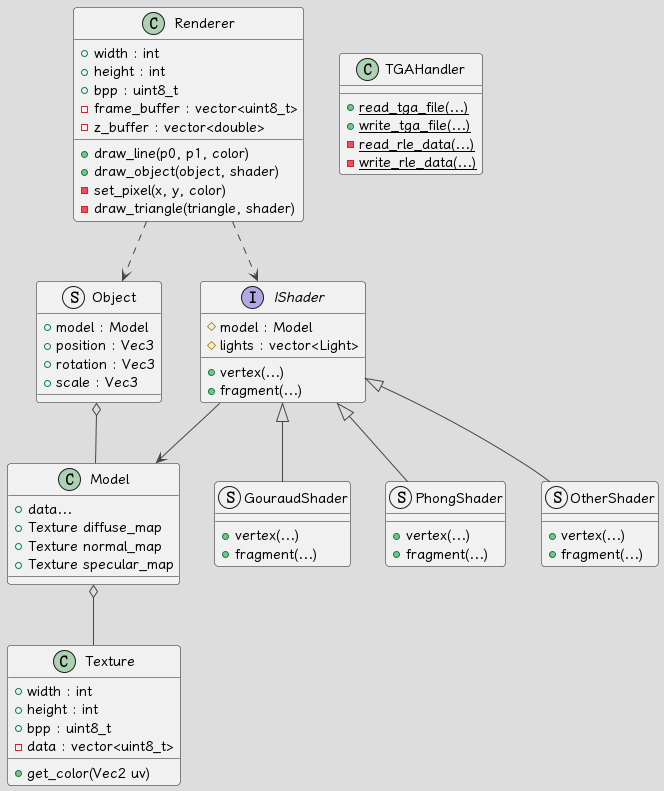

# Graphics - TinyRenderer

[English](../README.md)

> 你可以在[这里](../image)查看输出图像
>
> *由于 GitHub 不支持 `.tga` 图像，你可能需要下载查看*

这是计算机图形学课程的结课作业，一个基于 [tinyrenderer](https://github.com/ssloy/tinyrenderer/wiki) 的微型 C++ 软光栅渲染器。

我的目标是创建一个不依赖任何第三方库的足够灵活的渲染器，这对于理解光栅化渲染器的工作原理非常有帮助。



## 特性

- [x] 无第三方库依赖
- [x] 小型灵活的架构
- [x] 自建几何库（向量与矩阵操作）
- [x] `.obj` 模型读取
- [x] `.tga` 图片读取与写入（带 RLE 压缩算法）
- [x] 线段绘制
- [x] 重心坐标计算
- [x] 三角形光栅化
- [x] 深度缓冲
- [x] 法线贴图
- [x] 纹理映射
- [x] Phong 着色
- [x] 可定制的着色器
- [ ] 阴影映射
- [ ] 抗锯齿

## 架构



- [main.cpp](../main.cpp)

这是程序的主渲染流程。

1. 定义基本信息，如图像大小、模型路径、相机等
2. 加载模型和纹理
3. 初始化渲染器与着色器
4. 设置MVP矩阵和视口矩阵
5. 渲染!!!
6. 保存图像

你可以在 `main.cpp` 文件中定义你自己的着色器

- [geometry.h](../geometry.h) 和 [color.h](../color.h)

它们是基本的几何和颜色类，用于定义程序的基本数据结构。

`geometry` 使用 `template` 定义了 `Vec<int>`、`Mat<int, int>` 类，用于表示向量和矩阵。
它实现了一些基本的向量和矩阵操作，如 `+`、`-`、`*`、`/` 等，
以及一些有用的函数，如 `cross()`、`normalize()`、`invert()`、`transpose()` 等。

`color` 定义了 `Color` 类，用于表示图像的颜色，使用四位 `uint8_t` 存储颜色数据。

- [texture.h](../texture.h) 和 [model.h](../model.h)

它们用于加载纹理和模型。

`texture` 定义了 `Texture` 类，存储纹理图像的颜色数据。
并且它提供了 `get_color(uv)` 函数，让其他类可以在给定的 uv 坐标处获取纹理图像的颜色。

`model` 定义了 `Model` 类，可以读取 `.obj` 模型文件并将其数据（顶点，面，纹理等）加载到内存中。

- [renderer.h](../renderer.h)

它定义了 `Renderer` 类，这是程序的核心。
它包含了主要的渲染算法，如线条绘制、重心获取、三角形光栅化等。

图像颜色数据将存储在一个名为 `frame_buffer` 的 `vector<uint8_t>` 中，这是一种格式较为底层的格式，我想这有利于后续的开发。
我使用 bpp（每像素位数）作为偏移量来存储像素颜色和索引。

- [shader.h](../shader.h)

它是与渲染相关的类和方法的集合，包括 `Object` 和 `Camera` 等工具。
它还定义了基本的 `IShader` 接口，作为所有着色器的基类。

- [tga-handler.h](../tga-handler.h)

这是一个静态的 TGA 图像读取器和写入器，可以读取和写入带有 RLE 压缩的 TGA 图像。

## 实现

### 线段绘制

实现了Bresenham线段算法，可以绘制一条p0到p1的线段。

```c++
// Bresenham's line algorithm
void Renderer::draw_line(Vec2 p0, Vec2 p1, const Color &color) {
    // if (dx < dy) the line is steep
    // we need to sample it along y axis
    // but we can also get_transpose it, then we can still use x axis
    // just remember to re-get_transpose it when drawing it
    bool steep = false;
    if (std::abs(p0.x - p1.x) < std::abs(p0.y - p1.y)) {
        // get_transpose
        std::swap(p0.x, p0.y);
        std::swap(p1.x, p1.y);
        steep = true;
    }
    // make it left−to−right
    if (p0.x > p1.x) std::swap(p0, p1);

    // use error to approximate the distance between the line and the pixel, which can improve performance
    int x0 = std::floor(p0.x), y0 = std::floor(p0.y);
    int x1 = std::floor(p1.x), y1 = std::floor(p1.y);
    int dx = x1 - x0;
    int dy = y1 - y0;
    int per_error = std::abs(dy) * 2;
    int error = 0;
    int y = y0;
    for (int x = x0; x <= p1.x; x++) {
        if (steep)
            set_pixel(y, x, color); // if transposed, de−get_transpose
        else
            set_pixel(x, y, color);

        error += per_error;
        if (error > dx) {
            y += (p1.y > p0.y ? 1 : -1);
            error -= 2 * dx;
        }
    }
}
```

### 三角形绘制

#### 线段扫描法

这是一个传统的绘制三角形的方法，但它是为单线程CPU编程设计的老式方法，现在已经不太使用了。

*下面的代码基于Bresenham线段算法实现了线段扫描法*

```c++
// line sweeping triangle drawing
void Renderer::draw_triangle_linesweeping(Vec2 p0, Vec2 p1, Vec2 p2, const Color &color) {
    if (p0.y == p1.y && p1.y == p2.y) return;
    // make p0.y < p1.y < p2.y
    if (p0.y > p1.y) std::swap(p0, p1);
    if (p0.y > p2.y) std::swap(p0, p2);
    if (p1.y > p2.y) std::swap(p1, p2);

    double total_height = p2.y - p0.y;
    for (int y = 0; y <= total_height; ++y) {
        bool second_half = y > p1.y - p0.y || p0.y == p1.y;
        double segment_height = second_half ? p2.y - p1.y : p1.y - p0.y;
        double alpha = static_cast<double>(y) / total_height;
        double beta = static_cast<double>(y - (second_half ? p1.y - p0.y : 0)) / segment_height;
        Vec2 A = p0 + (p2 - p0) * alpha;
        Vec2 B = second_half ? p1 + (p2 - p1) * beta : p0 + (p1 - p0) * beta;
        if (A.x > B.x) std::swap(A, B);
        for (int x = static_cast<int>(A.x); x <= B.x; ++x) {
            set_pixel(x, static_cast<int>(p0.y + y), color);
        }
    }
}
```

#### 光栅化

光栅化是一种更现代的绘制三角形的方法，它是一种并行化的方法，可以利用多线程或GPU加速。其核心思想是：

> 遍历三角形的包围盒，对于每个像素，判断它是否在三角形内部，如果是，则填充颜色。

有两种方法可以用来判断一个点是否在三角形内部：

- 重心坐标法

[重心坐标](https://en.wikipedia.org/wiki/Barycentric_coordinate_system)是三角形的一个非常有用的特性，可以用来进行插值。这里，我们首先使用它来检查一个点是否在三角形内部。

```c++
// get barycentric
Vec3 Renderer::get_barycentric2D(const Vec2 *t, const Vec2 &p) {
    Mat<3, 3> ABC = {{embed<3>(t[0]), embed<3>(t[1]), embed<3>(t[2])}};
    if (std::abs(ABC.det()) < 1e-3) return {-1, 1, 1}; // degenerate check
    return ABC.invert().transpose() * embed<3>(p);
}
```

上面提供的函数通过求逆矩阵计算重心坐标，但是在 [geometry.h](../geometry.h) 中找到逆矩阵的方法是通过递归实现的，这可能会严重降低性能。
我们可以使用下面的方法，通过面积比例计算重心坐标作为替代：

```c++
// get barycentric
Vec3 Renderer::get_barycentric2D(const std::array<Vec2, 3> &t_vert, const Vec2 &p) {
    // calculate by area
    double x0 = t_vert[0][0], y0 = t_vert[0][1];
    double x1 = t_vert[1][0], y1 = t_vert[1][1];
    double x2 = t_vert[2][0], y2 = t_vert[2][1];
    double t_area = x0 * (y1 - y2) + x1 * (y2 - y0) + x2 * (y0 - y1);
    if (std::abs(t_area) < 1e-3) return {-1, 1, 1}; // degenerate check
    double u = (p.x * (y1 - y2) + (x2 - x1) * p.y + x1 * y2 - x2 * y1) / t_area;
    double v = (p.x * (y2 - y0) + (x0 - x2) * p.y + x2 * y0 - x0 * y2) / t_area;
    return {u, v, 1.0 - u - v};
}
```

- 叉乘法

我们可以使用叉乘法来检查一个点是否在三角形内部。
只需将三角形的每条边与连接每个顶点到给定点的线段进行叉乘，如果一个点在三角形内部，那么结果都应该同号。

```c++
// judge by cross product (like GAMES101)
bool Renderer::is_inside_triangle_cross_product(Vec2 *t, const Vec2 &P) {
    Vec2 AB = t[1] - t[0];
    Vec2 BC = t[2] - t[1];
    Vec2 CA = t[0] - t[2];
    Vec2 AP = P - t[0];
    Vec2 BP = P - t[1];
    Vec2 CP = P - t[2];
    double z1 = cross(AB, AP);
    double z2 = cross(BC, BP);
    double z3 = cross(CA, CP);
    return (z1 > 0 && z2 > 0 && z3 >0) || (z1 < 0 && z2 < 0 && z3 < 0);
}
```

- 来画三角形吧！

之后，我们可以使用以下步骤来绘制三角形：

1. 计算三角形的包围盒 （用于加速计算）
2. 遍历包围盒内的每个像素
3. 对于每个像素，检查它是否在三角形内部并且进行深度测试
4. 如果通过测试，就填充颜色

*在下面的代码中，我使用了重心坐标来判断一个点是否在三角形内*

```c++
// triangle drawing with barycentric
void Renderer::draw_triangle(const Mat<3, 4> &t_vert_clip, IShader &shader) {
    // clip space 2 screen space
    std::array<Vec2, 3> t_vert_screen_vec2 = {
            resize<2>(ViewportMatrix * t_vert_clip[0] / t_vert_clip[0][3]),
            resize<2>(ViewportMatrix * t_vert_clip[1] / t_vert_clip[1][3]),
            resize<2>(ViewportMatrix * t_vert_clip[2] / t_vert_clip[2][3])
    };
    // create bounding box
    int bbox_min[2] = {width_ - 1, height_ - 1};
    int bbox_max[2] = {0, 0};
    for (int i = 0; i < 3; ++i)
        for (int j = 0; j < 2; ++j) {
            bbox_min[j] = std::min(bbox_min[j], static_cast<int>(t_vert_screen_vec2[i][j]));
            bbox_max[j] = std::max(bbox_max[j], static_cast<int>(t_vert_screen_vec2[i][j]));
        }
    // Ensure the bounding box is within the image boundaries
    bbox_min[0] = std::max(0, bbox_min[0]);
    bbox_min[1] = std::max(0, bbox_min[1]);
    bbox_max[0] = std::min(width_ - 1, bbox_max[0]);
    bbox_max[1] = std::min(height_ - 1, bbox_max[1]);

#pragma omp parallel for // omp optimization (I hope so)
    for (int x = bbox_min[0]; x <= bbox_max[0]; x++) {
        for (int y = bbox_min[1]; y <= bbox_max[1]; y++) {
            Vec3 bc_screen = get_barycentric2D(t_vert_screen_vec2, {static_cast<double>(x), static_cast<double>(y)});
            if (bc_screen.x < 0 || bc_screen.y < 0 || bc_screen.z < 0) continue; // triangle testing

            // inside triangle
            Vec3 bc_clip = {bc_screen.x / t_vert_clip[0][3], bc_screen.y / t_vert_clip[1][3], bc_screen.z / t_vert_clip[2][3]};
            bc_clip = bc_clip / (bc_clip.x + bc_clip.y + bc_clip.z); // perspective correction, make sure bc.x + bc.y + bc.z = 1
            double depth = t_vert_clip[0][2] * bc_clip.x + t_vert_clip[1][2] * bc_clip.y + t_vert_clip[2][2] * bc_clip.z;
            if (depth > depth_buffer_[x + y * width_]) continue; // depth testing

            // depth test passed
            Color color;
            if (!shader.fragment(bc_clip, color)) continue;

            // fragment shader passed
            set_pixel(x, y, color);
            depth_buffer_[x + y * width_] = depth;
        }
    }
}
```

### 变换

变换矩阵用于将模型从模型空间转换到屏幕空间，以下是详细过程。

> Model Space -> World Space -> View Space -> Clip Space -> (NDC) -> Screen Space

- Model Matrix (Model Space -> World Space)

```c++
void set_model_mat(double angle, double scale, Vec3 translate) {
    angle = angle * M_PI / 180.0;
    Mat<4, 4> rotation_mat({{{
        {cos(angle), 0, sin(angle), 0},
        {0, 1, 0, 0},
        {-sin(angle), 0, cos(angle), 0},
        {0, 0, 0, 1}
    }}});

    Mat<4, 4> scale_mat({{{
        {scale, 0, 0, 0},
        {0, scale, 0, 0},
        {0, 0, scale, 0},
        {0, 0, 0, 1}
    }}});

    Mat<4, 4> translate_mat({{{
        {1, 0, 0, translate.x},
        {0, 1, 0, translate.y},
        {0, 0, 1, translate.z},
        {0, 0, 0, 1}
    }}});

    ModelViewMatrix = translate_mat * rotation_mat * scale_mat;
}
```

- View Matrix (World Space -> View Space)

```c++
void set_view_mat(const Vec3 &eye_point) {
    Mat<4, 4> view_matrix = {{{
        {1, 0, 0, -eye_point.x},
        {0, 1, 0, -eye_point.y},
        {0, 0, 1, -eye_point.z},
        {0, 0, 0, 1}
    }}};

    ModelViewMatrix = view_matrix * ModelViewMatrix;
}
```

- Projection Matrix (View Space -> Clip Space)

```c++
void set_projection_mat(double fov, double aspect_ratio, double zNear, double zFar) {
    Mat<4, 4> p2o({{{
        {zNear, 0, 0, 0},
        {0, zNear, 0, 0},
        {0, 0, zNear + zFar, -zNear * zFar},
        {0, 0, 1, 0}
    }}});

    double angle = fov / 180.0 * M_PI;
    double t = tan(angle / 2) * zNear;
    double b = -t;
    double r = t * aspect_ratio;
    double l = -r;
    Mat<4, 4> o2c({{{
        {2 / (r - l), 0, 0, -(r + l) / (r - l)},
        {0, 2 / (t - b), 0, -(t + b) / (t - b)},
        {0, 0, 2 / (zNear - zFar), -(zNear + zFar) / (zNear - zFar)},
        {0, 0, 0, 1}
    }}});

    ProjectionMatrix = o2c * p2o;
}
```

- Viewport Matrix (Clip Space -> Screen Space)

```c++
void set_viewport_mat(int x, int y, int w, int h) {
    ViewportMatrix = {{{
        {w / 2.0, 0, 0, x + w / 2.0},
        {0, h / 2.0, 0, y + h / 2.0},
        {0, 0, 0.5, 0.5},
        {0, 0, 0, 1}
    }}};
}
```

### 着色

- 基础顶点着色器

这是一个基本的顶点着色器，它可以将顶点从模型空间转换到裁剪空间并存储一些片元着色器可能用到的数据。

之后给出的片元着色器都基于这个顶点着色器。

```c++
struct StandardVertexShader : IShader {
public:
    explicit StandardVertexShader(const Model& model, std::vector<Light>&& lights = std::vector<Light>())
        : IShader(model, std::move(lights)) {
        for (auto& light : lights_) {
            // uniform light direction in view coordinates
            light.direction = resize<3>((ModelViewMatrix * resize<4>(light.direction, 0))).normalize();
            light.intensity = resize<3>((ModelViewMatrix * resize<4>(light.intensity, 0)));
        }
    }

    void vertex(int i_face, int nth_vert, Vec4 &ret_vert) override {
        // column-major order, which is convenient for fragment shader
        varying_uv.set_col(nth_vert, model_.uv(i_face, nth_vert));
        varying_normal.set_col(nth_vert,
                               resize<3>( (ModelViewMatrix).invert_transpose() * resize<4>(model_.normal(i_face, nth_vert), 0) ));
        // model space -> world space -> view space
        ret_vert = ModelViewMatrix * resize<4>(model_.vert(i_face, nth_vert), 1);
        // store the vertex in view space for the fragment shader
        t_vert_view_space.set_col(nth_vert, resize<3>(ret_vert));
        // view space -> clip space
        ret_vert = ProjectionMatrix * ret_vert;
    }

protected:
    Mat<2, 3> varying_uv;
    Mat<3, 3> varying_normal;
    Mat<3, 3> t_vert_view_space;
};
```

- Gouraud 着色

Gouraud 着色只考虑法线与光线的夹角，它是一种简单的着色方法。

```c++
bool fragment(const Vec3 &bc, Color &ret_color) override {
    Vec3 interpolated_normal = (varying_normal * bc).normalize();
    double intensity = 0.0;
    for (const auto& light : lights_) {
        intensity += std::max(0.0, interpolated_normal * light.direction);
    }
    ret_color = Color{255, 255, 255, 255} * intensity;
    return true;
}
```

- Phong 着色 (加上了纹理映射)

Phong 着色假设光可以分解为三个部分：环境光、漫反射光和镜面光。

```c++
bool fragment(const Vec3 &bc, Color &ret_color) override {
    Vec3 interpolated_normal = (varying_normal * bc).normalize();
    Vec2 interpolated_uv = varying_uv * bc;
    double intensity = 0.0;
    for (const auto &light: lights_) {
        double diffuse = std::max(0.0, interpolated_normal * light.direction);
        Vec3 reflected_light = (interpolated_normal * (interpolated_normal * light.direction) * 2 - light.direction).normalize();
        double specular = std::pow(std::max(0.0, -reflected_light.z), model_.specular()->get_color(interpolated_uv)[0] + 5);
        intensity += diffuse + specular;
    }
    Color fragment_color = model_.diffuse()->get_color(interpolated_uv);
    for (int i : {0, 1, 2}) {
        ret_color[i] = std::min<int>((int)(fragment_color[i] * intensity), 255);
    }
    return true;
}
```

- Phong 着色 (加上了法线贴图)

法线贴图是一种用于模拟凹凸光照的技术。这里我们实时计算了TBN矩阵，然后将法线贴图的法线转换到视图空间。

```c++
bool fragment(const Vec3 &bc, Color &ret_color) override {
    Vec3 interpolated_normal = (varying_normal * bc).normalize();
    Vec2 interpolated_uv = varying_uv * bc;

    Mat<3, 3> AI = Mat<3, 3>{{
        t_vert_view_space.col(1) - t_vert_view_space.col(0),
        t_vert_view_space.col(2) - t_vert_view_space.col(0),
        interpolated_normal
    }}.invert();
    Vec3 tangent = AI * Vec3{
        varying_uv[0][1] - varying_uv[0][0],
        varying_uv[0][2] - varying_uv[0][0],
        0};
    Vec3 bitangent = AI * Vec3{
        varying_uv[1][1] - varying_uv[1][0],
        varying_uv[1][2] - varying_uv[1][0],
        0};
    Mat<3, 3> TBN = Mat<3, 3>{{
        tangent.normalize(),
        bitangent.normalize(),
        interpolated_normal}}.transpose();
    Vec3 mapping_normal = (TBN * model_.normal(interpolated_uv)).normalize();
    double intensity = 0.0;
    for (const auto &light: lights_) {
        double diffuse = std::max(0.0, mapping_normal * light.direction);
        Vec3 reflected_light = (mapping_normal * (mapping_normal * light.direction) * 2 - light.direction).normalize();
        double specular = std::pow(std::max(-reflected_light.z, 0.0), model_.specular()->get_color(interpolated_uv)[0] + 5);
        intensity += diffuse + specular;
    }
    Color fragment_color = model_.diffuse()->get_color(interpolated_uv);
    for (int i : {0, 1, 2}) {
        ret_color[i] = std::min((int)(fragment_color[i] * intensity + amb_light_intensity[i]), 255);
    }
    return true;
}
```